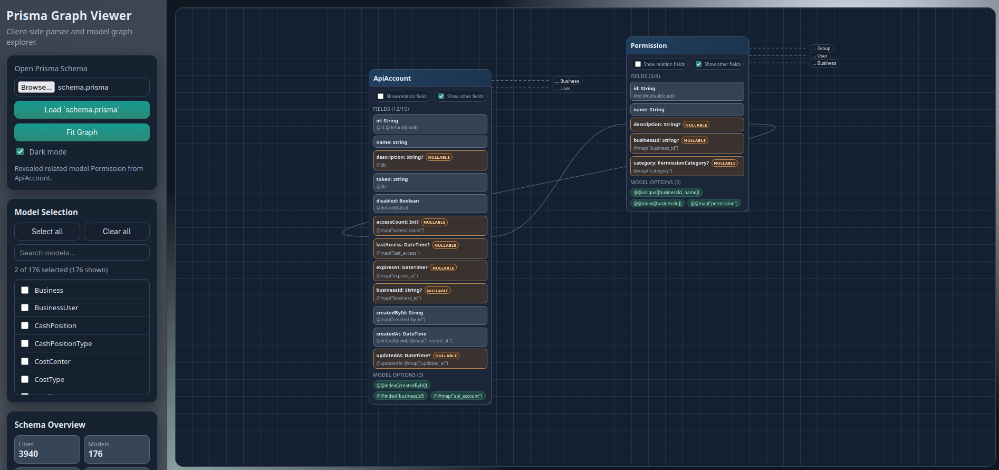

## pview - Prisma Schema viewer

This is a simple prisma schema viewer. It runs completely from the `index.html` file, no web server is needed.

Open `index.html` in your browser via File/Open and load a prisma `schema.prisma` file.

Use at your own risk, this is just a codex created tool.
